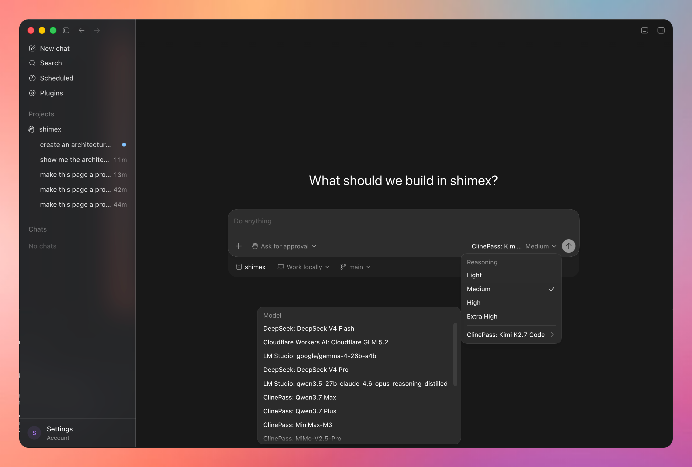
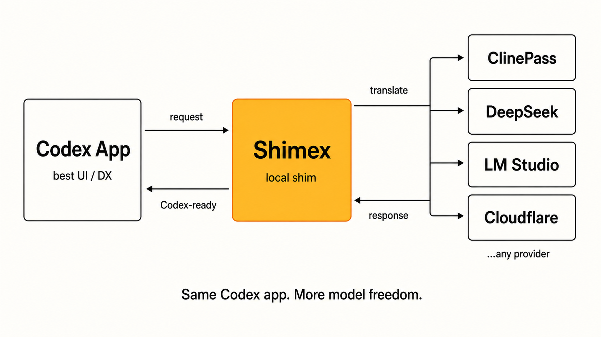

# Shimex

<p align="center">
  
</p>

<p align="center">
  <a href="screenshot.png"></a>
</p>

<p align="center">
  <strong>Use your own LLM providers in Codex Desktop, without modifying Codex.</strong>
</p>

<p align="center">
  <a href="http://shimex.xyz/">shimex.xyz</a>
</p>

> **Latest update:** Shimex supports OpenAI's GPT-5.6 Sol, Terra, and Luna models in the Codex model picker.

Shimex creates a managed copy of Codex Desktop and points it at a local
OpenAI-compatible gateway. That lets Codex use your configured providers —
hosted APIs, local model servers, and external CLI sessions — while your
original Codex app stays untouched.

---

## Table of Contents

- [What is Shimex?](#what-is-shimex)
- [Architecture](#architecture)
- [Supported Capabilities](#supported-capabilities)
- [Getting Started](#getting-started)
- [Configuration](#configuration)
- [Providers](#providers)
- [Commands](#commands)
- [Development](#development)
- [Tests](#tests)
- [macOS Signing & Keychain](#macos-signing--keychain)
- [Credits](#credits)
- [License](#license)

---

## What is Shimex?

Shimex is a **local Node.js daemon** that lets Codex Desktop use your configured
LLM providers — hosted APIs, local model servers, OpenAI-compatible endpoints,
and external CLI sessions. It:

- Copies your real Codex Desktop app into a managed `Shimex.app` (leaving the
  original untouched).
- Generates an isolated Codex profile and model catalog that points at Shimex's
  local API server.
- Exposes an OpenAI-compatible HTTP/SSE endpoint at `http://127.0.0.1:5413/v1`.
- Routes requests to your configured providers — hosted APIs, local model
  servers, OpenAI-compatible endpoints, or external CLI tools — normalising each
  provider's protocol behind a single surface.
- Discovers models dynamically (cache-backed) so your picker stays fresh without
  blocking startup.

Shimex expects you already have [Codex Desktop](https://openai.com/codex/) installed
at `/Applications/Codex.app`.

---

## Architecture

Shimex follows a layered architecture with strict dependency direction. Core never
imports provider or client modules directly — composition happens through the
registry layer.

<p align="center">
  
</p>

```text
CLI / HTTP / Admin UI
        -> product functions
        -> semantic core
        -> provider and client adapters
```

### Layer Map

| Layer | Directory | Responsibility |
|---|---|---|
| **CLI / HTTP / Admin** | `src/cli/`, `src/server/`, `src/admin/` | User-facing surfaces; call product functions but own no logic |
| **Client Adapters** | `src/clients/codex/` | Codex app discovery, managed copy, isolated profile, model picker catalog |
| **Semantic Core** | `src/core/` | Config, env, model types, capabilities, cache-backed discovery, YAML — provider-neutral |
| **Provider Adapters** | `src/providers/` | Auth, discovery, request shapes, streaming quirks per provider |

### Package Map

```text
src/
├── cli/main.js              CLI entrypoint
├── admin/page.js            Admin dashboard (bare local UI)
├── server/
│   ├── httpServer.js        OpenAI-compatible HTTP/SSE server
│   └── process.js           Process lifecycle management
├── clients/codex/
│   ├── catalog.js           Codex model picker catalog generator
│   ├── lifecycle.js         Install, sync, and start the managed app
│   ├── patch.js             App bundle patching (icons, asar, plist)
│   ├── paths.js             Codex app discovery and path resolution
│   └── doctor.js            Prerequisite diagnostics
├── core/
│   ├── config.js            shimex.yml loading and normalisation
│   ├── env.js               .env and shell env loading
│   ├── model.js             Model type definitions and schemas
│   ├── modelCache.js        Cache-backed model store
│   ├── modelDiscovery.js    Dynamic model discovery orchestration
│   ├── paths.js             Provider-neutral path utilities
│   └── simpleYaml.js        Minimal YAML parser
└── providers/
    ├── index.js             Provider registry
    ├── adapter.js           Request adapter dispatch
    ├── routes.js            Route metadata
    ├── http.js              Shared HTTP helpers
    ├── openai-compatible/   Shared protocol adapter for OpenAI-compatible APIs
    ├── anthropic/           Anthropic Messages adapter
    ├── deepseek/            DeepSeek (Anthropic-compatible)
    ├── cloudflare-workers-ai/
    ├── lm-studio/           Local LM Studio (OpenAI-compatible)
    ├── ollama/              Local Ollama (OpenAI-compatible)
    ├── chatgpt-codex/       ChatGPT/Codex passthrough
    ├── cursor-composer/     Cursor Composer passthrough
    ├── cline-pass/          ClinePass passthrough
    ├── openai-responses/    OpenAI Responses API adapter
    └── auto-router/         Virtual model router
```

### Provider Inventory

| Provider | ID | Protocol | Notes |
|---|---|---|---|
| Anthropic | `anthropic` | Messages API | Direct Anthropic API |
| DeepSeek | `deepseek` | Anthropic-compatible | `api.deepseek.com/anthropic` |
| OpenAI Compatible | `openai-compatible` | Chat Completions | Generic endpoint |
| OpenAI Responses | `openai-responses` | Responses API | |
| Cloudflare Workers AI | `cloudflare-workers-ai` | REST | Account-scoped |
| Ollama | `ollama` | OpenAI-compatible | Local models |
| LM Studio | `lm-studio` | OpenAI-compatible | Local models |
| ChatGPT / Codex | `chatgpt-codex` | Passthrough | **Multi-account.** Each ChatGPT/Codex login becomes a profile (e.g. `personal-gpt-5-5`, `work-gpt-5-5`) in the picker. |

| Cursor Composer | `cursor-composer` | Passthrough | Text-only bridge via `cursor-agent` |
| ClinePass | `cline-pass` | Passthrough | External CLI login |
| Auto Router | `auto-router` | Virtual | Classifier-based routing |

---


## Supported Capabilities

### API Surface

Shimex exposes an OpenAI-compatible HTTP/SSE server at `http://127.0.0.1:5413`.

| Endpoint | Method | Description |
|---|---|---|
| `/health` | `GET` | Health check — returns `{ ok: true, service: "shimex" }` |
| `/v1/chat/completions` | `POST` | OpenAI Chat Completions API |
| `/v1/responses` | `POST` | OpenAI Responses API |
| `/v1/responses/compact` | `POST` | Compact variant of Responses (forces `stream: false`) |
| `/v1/models` | `GET` | OpenAI model list |
| `/codex/model-catalog.json` | `GET` | Codex Desktop picker catalog |
| `/api/models` | `GET` | Full Shimex model metadata |
| `/api/status` | `GET` | Doctor diagnostics + model list |
| `/api/install` | `POST` | Prepare managed `Shimex.app` |
| `/api/sync` | `POST` | Sync managed app config |
| `/api/open` | `POST` | Launch managed app |
| `/api/stop` | `POST` | Stop the Shimex server |
| `/admin` | `GET` | Bare local admin dashboard |

### Protocols Handled

| Protocol | Providers | Request shape | Response shape |
|---|---|---|---|
| **OpenAI Chat Completions** | `openai-compatible`, `ollama`, `lm-studio`, `cloudflare-workers-ai`, `cline-pass` | Chat messages with tools, streaming | Chat completion + SSE chunks |
| **OpenAI Responses** | `openai-responses`, `chatgpt-codex` | Responses API input/output items | Response object + SSE events |
| **Anthropic Messages** | `anthropic`, `deepseek` | Messages with tool use blocks | Messages response (translated) |
| **Cursor Agent CLI** | `cursor-composer` | Prompt text via `cursor-agent` subprocess | Text + structured events |
| **Auto Router** | `auto-router` | Delegated to a classified candidate | Passthrough from selected provider |

### Protocol Translation

Shimex normalises all providers behind two inbound shapes (`/v1/chat/completions` and `/v1/responses`):

| Inbound → Upstream | Translation |
|---|---|
| Chat → Chat | Direct passthrough with model ID rewrite |
| Chat → Responses | `responsesToChat` — converts input items to messages, tools to function format |
| Chat → Anthropic | `chatToAnthropic` — converts messages to Anthropic blocks, tools to `input_schema` |
| Responses → Chat | `responsesToChat` — `v1/responses` body to Chat Completions body |
| Responses → Responses | Direct passthrough with model ID rewrite |
| Responses → Anthropic | `responsesToAnthropic` — two-step: responses→chat→anthropic |

Streaming is supported for all combinations. Non-streaming upstream APIs (Anthropic, Responses where stream unsupported) are wrapped into single-chunk SSE streams so the consumer always sees SSE.

### Provider Support Matrix

| Provider | Kind | Auth | Discovery | Chat | Responses | Streaming | Tools | Image Input |
|---|---|---|---|---|---|---|---|---|
| `anthropic` | byok | `ANTHROPIC_API_KEY` | Configured | ✅ | ✅ | ✅ (buffered) | ✅ | ✅ |
| `auto-router` | virtual | None | Candidate set | ✅ | ✅ | ✅ (delegated) | ✅ | ✅ (routing only) |
| `chatgpt-codex` | external-session | Codex login session | Cached/static | ✅ | ✅ | ✅ | ✅ | ✅ |
| `cline-pass` | external-session | External Cline auth | Dynamic (`/recommended-models`) | ✅ | ✅ | ✅ | ✅ | Per-model |
| `cloudflare-workers-ai` | byok | `CLOUDFLARE_AUTH_TOKEN` + `CLOUDFLARE_ACCOUNT_ID` | Configured + `/models` refresh | ✅ | ✅ | ✅ | ✅ | ❌ (text-only configs) |
| `cursor-composer` | external-cli-session | `cursor-agent status` | Static | ✅ | ✅ | ✅ | ❌ | ❌ (text-only bridge) |
| `deepseek` | byok | `DEEPSEEK_API_KEY` | Configured | ✅ | ✅ | ✅ (buffered) | ✅ | ❌ (text-only models) |
| `lm-studio` | local | None | Configured + `/models` refresh | ✅ | ✅ | ✅ | ✅ | ❌ (text-only) |
| `ollama` | local | None | Configured + `/models` refresh | ✅ | ✅ | ✅ | ✅ | ❌ (text-only) |
| `openai-compatible` | byok | Env or header | Configured + `/models` refresh | ✅ | ✅ | ✅ | ✅ | Per-model |
| `openai-responses` | byok | Env or header | Configured + `/models` refresh | ✅ | ✅ | ✅ | ✅ | Per-model |

### Feature Support

| Feature | Status | Notes |
|---|---|---|
| **Streaming** | ✅ | SSE for all providers; buffered-chunk stream when upstream lacks native SSE |
| **Tool / function calling** | ✅ | Chat tools and Responses function_call items; translated for Anthropic |
| **Image input** | ⚠️ Per-provider | Only `anthropic`, `chatgpt-codex`, and image-capable `cline-pass` / `openai-compatible` models; text-only models reject images with a clear error |
| **System / developer messages** | ✅ | Converted to `system` role for chat, top-level `system` for Anthropic, `instructions` for Responses |
| **Reasoning effort** | ⚠️ Forwarded | `reasoning_effort` parameter forwarded when upstream supports it; not validated |
| **Model discovery** | ✅ | Cache-backed, best-effort refresh on startup; falls back to configured/static models |
| **Auto Router** | ✅ | Classifier-based candidate scoring with deterministic fallback; 256-entry decision cache |
| **Managed app installation** | ✅ | Copies Codex.app → Shimex.app; patches icons, asar, plist; ad-hoc re-signs |
| **Isolated profile** | ✅ | Separate Codex profile at `~/.shimex/codex-profile`; `seed_local_auth` injects local API key |
| **Env interpolation** | ✅ | `${VAR}` in `shimex.yml` resolves from `.env` then shell env |
| **Detached daemon** | ✅ | `npm start` launches server as detached background process with PID file |
| **Admin UI** | ✅ | Bare HTML dashboard at `/admin` showing status and models |
| **CLI** | ✅ | `help`, `doctor`, `providers list`, `models list`, `server start/stop`, `start`, `dev`, `status`, `stop` |
| **Health check** | ✅ | `GET /health` |
| **Error handling** | ✅ | Typed errors (`shimex_unknown_model`, `shimex_auth_unavailable`, `shimex_unsupported_modality`, etc.) |
| **Provider config validation** | ✅ | Unknown capabilities stay unknown; no guessing of image/tool/context/reasoning support |

### Limitations

| Limitation | Details |
|---|---|
| **No native Anthropic streaming** | Anthropic and DeepSeek requests are buffered (sent with `stream: false`), then replayed as a single SSE chunk |
| **Cursor Composer text-only** | `cursor-agent` bridge uses prompt input, not image transport; image requests return an error |
| **No tool/function support in Cursor** | Cursor Composer adapter strips tools and sends plain prompt text |
| **No dynamic model discovery for Anthropic/DeepSeek** | These providers use configured model lists only; no API-based discovery |
| **macOS only** | Codex app discovery, managed copy, and bundle patching hardcoded for macOS paths |
| **Single managed app** | One `Shimex.app` copy; no multi-instance support |
| **No WebSocket** | All streaming is SSE; `prefer_websockets: false` in catalog |
| **No search tool** | `supports_search_tool: false` across all catalog entries |
| **No verbosity control** | `support_verbosity: false` |
| **No reasoning summaries** | `supports_reasoning_summaries: false` |

### Error Types

| Type | HTTP Status | Meaning |
|---|---|---|
| `shimex_unknown_model` | 404 | Model slug not found in any enabled provider |
| `shimex_adapter_missing` | 501 | Provider has no registered request adapter |
| `shimex_auth_unavailable` | 401 | Auth token/env variable missing or expired |
| `shimex_unsupported_modality` | 400 | Model does not support the requested input modality (e.g., image sent to text-only model) |
| `shimex_auto_router_no_candidate` | 400 | No viable Auto Router candidate for this request |
| `shimex_route_loop` | 500 | Auto Router redirect depth exceeded |

## Getting Started

### Prerequisites

- macOS with Codex Desktop installed at `/Applications/Codex.app`
- Node.js >= 20.0.0
- npm >= 10.0.0

### Install

```bash
git clone <shimex-repo-url> ~/Projects/shimex
cd ~/Projects/shimex
npm install
```

### Configure Secrets

Copy the example env file and add your API keys:

```bash
cp .env.example .env
```

Edit `.env` with your provider keys:

```env
ANTHROPIC_API_KEY=<your-anthropic-api-key>
DEEPSEEK_API_KEY=<your-deepseek-api-key>
OPENAI_COMPATIBLE_BASE_URL=https://api.openai.com/v1
OPENAI_COMPATIBLE_API_KEY=<your-openai-compatible-api-key>
CLOUDFLARE_ACCOUNT_ID=<your-cloudflare-account-id>
CLOUDFLARE_AUTH_TOKEN=<your-cloudflare-auth-token>
```

`.env` is git-ignored and loaded automatically before `shimex.yml` is expanded.

### Start

```bash
npm start
```

This prepares the managed `Shimex.app`, writes the isolated Shimex Codex profile,
starts the local gateway as a detached process, and opens the managed app. The
gateway listens at `http://127.0.0.1:5413`.

Open the admin UI at `http://127.0.0.1:5413/admin` (`5413` reads as “SHIE” in leetspeak).

### Verify

```bash
npm run status            # Health, PID, and log path
npm run shimex -- doctor  # Prerequisite check
npm run shimex -- providers list   # Configured providers
npm run shimex -- models list      # Discovered models
```

### Updating

When Codex Desktop releases an update, Shimex picks it up automatically:

```bash
npm run stop:all && npm start
```

Shimex re-copies the upstream Codex app into the managed `Shimex.app`, reapplies patches, and restarts the gateway with the latest version.


---

## Configuration

Shimex is configured through `shimex.yml` at the repo root. All paths, ports,
providers, and model lists are defined there.

### Top-level Structure

```yaml
project:
  name: shimex
  package_manager: npm

runtime:
  host: 127.0.0.1
  port: 5413
  home: ~/.shimex

codex:
  source_app: auto
  managed_app_name: Shimex
  managed_app_path: ~/Applications/Shimex.app
  profile_home: ~/.shimex/codex-profile
  user_data_dir: ~/.shimex/codex-user-data
  icon_path: icon.png
  seed_local_auth: true
```

### Env Interpolation

Use `${ENV_NAME}` in `shimex.yml` to reference environment variables (from `.env`
or the shell). Example:

```yaml
- id: openai-compatible
  endpoint: ${OPENAI_COMPATIBLE_BASE_URL}
  auth:
    type: env
    name: OPENAI_COMPATIBLE_API_KEY
```

### Provider Auth Types

| Type | Description |
|---|---|
| `env` / `env:NAME` | Read a single secret from an environment variable |
| `env:NAMES` | Try multiple environment variables in order |
| `external-codex-login` | Use the user's existing Codex Desktop session |
| `external-cli-login` | Validate auth via an external CLI command |

---

## Providers

### Adding a Provider

1. Create `src/providers/<provider-id>/`.
2. Export a manifest with `id`, `displayName`, `kind`, `protocol`, `auth`,
   `capabilitySource`, and `requestAdapter`.
3. Register it in `src/providers/index.js`.
4. Implement or reuse a request adapter in `src/providers/<provider-id>/adapter.js`.
5. Register the adapter in `src/providers/adapter.js`.
6. Add a `shimex.yml` example entry.
7. Add tests showing models appear in `/v1/models`, the Codex catalog, and at
   least one deterministic request route.

### OpenAI-Compatible Providers

For providers with a standard OpenAI-compatible chat endpoint, use the shared
`openai-compatible` provider shape. Do not create a bespoke provider unless the
upstream has genuinely different auth, discovery, or request behavior.

### Multi-Account ChatGPT / Codex Profiles

Shimex stores ChatGPT / Codex logins in a centralised, gitignored JSON file at
`~/.shimex/codex-auths.json`. Each profile has a name, the OAuth access + refresh
tokens, and the `chatgpt_account_id` extracted from the access-token JWT.

Three ways to add a profile:

| Way | When to use |
|---|---|
| **Sign in with OpenAI Codex** (admin UI) | The server can reach `auth.openai.com`. A new tab opens, you confirm on chatgpt.com, and Shimex polls until the access/refresh tokens land. |
| **Paste OAuth JSON** (admin UI or `codex-auth add`) | Headless servers, or you already have tokens exported from another machine. |
| **Import `~/.codex/auth.json`** | The legacy single-account mode — Shimex reads the file from the original Codex app install. |

Each profile surfaces in the Codex picker as `profile-model` slugs (for example,
`personal-gpt-5-5`, `work-gpt-5-5`). Inside Shimex, picking `personal-gpt-5-5`
authenticates upstream requests with the personal access token + `chatgpt-account-id`,
picking `work-gpt-5-5` does the same with the work token. Legacy single-account
mode still works — Shimex falls back to `~/.codex/auth.json` when no profile is
configured.

CLI:

```bash
npm run shimex -- codex-auth list                            # show profiles + account ids
npm run shimex -- codex-auth add personal ~/.codex/auth.json  # import from another Codex install
npm run shimex -- codex-auth add work path/to/work.json       # paste JSON from elsewhere
npm run shimex -- codex-auth use personal                     # set default profile
npm run shimex -- codex-auth remove work                      # delete a profile
```

HTTP:

| Method | Path | Description |
|---|---|---|
| `GET`   | `/api/codex-auths` | List all profiles (with masked account ids). |
| `POST`  | `/api/codex-auths` | Add or update a profile. Body: `{ name, auth_json?, label?, note? }`. |
| `POST`  | `/api/codex-auths/{name}/use` | Set a profile as default. |
| `DELETE`| `/api/codex-auths/{name}` | Disconnect (remove) a profile. |
| `POST`  | `/api/codex-auths/start-device` | Begin the OAuth device-code flow. Body: `{ profile }`. |
| `GET`   | `/api/codex-auths/device/{id}` | Poll device-flow status. |
| `POST`  | `/api/codex-auths/device/{id}/complete` | Commit saved credentials. |
| `DELETE`| `/api/codex-auths/device/{id}` | Cancel an in-flight device flow. |
| `GET`   | `/api/codex-auths/{name}/credits` | Probe `chatgpt.com/backend-api/wham/rate-limit-reset-credentials` for the remaining `available_count` / `total_earned_count` / credited expiry. |

### Model Discovery

Configured `models` entries are always used as written. Providers can also
refresh model caches on startup:

```yaml
providers:
  - id: cline-pass
    enabled: true
    models:
      refresh: on_start
```

Refresh is best-effort. If the upstream endpoint or auth is unavailable, Shimex
falls back to configured models, cached models, or the provider's static list.

### Auto Router

`auto-router` is a virtual provider that routes requests to the cheapest viable
candidate. Without a classifier, it uses deterministic selection. With a
classifier configured, Shimex asks a model to score candidates and picks the
cheapest above the threshold.

```yaml
- id: auto-router
  enabled: true
  slug: shimex-auto
  classifier: classifier-model-slug
  threshold: 0.7
  default: balanced-model-slug
  cache: true
  candidates:
    - slug: cheap-model-slug
      cost: 1
      card: Fast, low-cost edits.
    - slug: strong-model-slug
      cost: 5
      card: Hard debugging and architecture work.
```

If the classifier fails, routing degrades to deterministic candidate selection
rather than breaking the user's request.

### Model Picker Requirements

Models that appear in the Codex Desktop picker must include:

- `slug` — stable identifier
- `displayName` — human-readable name
- `providerId` — owning provider
- `upstreamModel` — upstream model ID
- `contextWindow` — token limit
- `inputModalities` — e.g., `[text]` or `[text, image]`

Image support additionally requires `supports_image_detail_original: true` in
the Codex catalog entry and a provider adapter that can translate image parts
for the upstream API. Text-only models must reject image input clearly instead
of dropping image parts silently.

---

## Commands

### npm Scripts

| Command | Description |
|---|---|
| `npm start` | Start the Shimex daemon, prepare the managed app, and open it |
| `npm run dev` | Run the server in the foreground with the managed app open (for debugging) |
| `npm run backend` / `npm run backend:start` | Start or reuse only the detached backend; do not open/restart `Shimex.app` |
| `npm run backend:restart` | Restart only the detached backend; leave the managed app running |
| `npm run backend:dev` | Run only the backend in the foreground |
| `npm run backend:stop` | Stop only the detached backend |
| `npm run status` / `npm run backend:status` | Show health, PID, and log path |
| `npm run stop` | Stop the daemon |
| `npm test` | Run the test suite |
| `npm run check` | Run tests + doctor diagnostics |

### CLI

```bash
npm run shimex -- help
npm run shimex -- doctor               # Check Codex prereqs and config
npm run shimex -- providers list       # List configured providers
npm run shimex -- models list          # List discovered models
npm run shimex -- server ensure        # Start/reuse detached backend only
npm run shimex -- server restart       # Restart detached backend only
npm run shimex -- server start         # Start the gateway server in the foreground
npm run shimex -- server stop          # Stop the gateway server

# ChatGPT/Codex multi-account management
npm run shimex -- codex-auth list
npm run shimex -- codex-auth add <name> [<token.json-path>|-]
npm run shimex -- codex-auth use <name>
npm run shimex -- codex-auth remove <name>
```

### Make Targets

```bash
make help         # List all targets
make check        # npm test + shimex doctor
make test         # npm test
make run          # Start local server in the foreground
make backend      # Start/reuse detached backend only
make backend-restart # Restart detached backend only
make doctor       # Prerequisite diagnostics
make providers    # List providers
make models       # List models
```

---

## Development

### Running Locally

```bash
npm run dev
```

This starts the HTTP server in the foreground and opens the managed Shimex app.
Server logs are streamed to the terminal.

If `Shimex.app` is already open and you only want to cycle the gateway after
backend/admin changes, use:

```bash
npm run backend:restart
# or: npm run shimex -- server restart
```

That stops and starts only the detached local backend. It does not copy, patch,
open, or quit the managed Codex app.

### Project Layout

- Source is under `src/`, organised by layer (core, providers, clients, server,
  cli, admin).
- Tests live under `tests/` with file names matching the module they test.
- Dependencies are zero beyond Node.js built-ins — no external npm packages needed.

### Code Style

- ES modules (`"type": "module"`).
- Keep source files small and split by ownership.
- Avoid broad utility folders.
- Core must not import provider or client modules directly.
- No legacy or fallback code paths without a current migration reason and
  removal condition.

### Quality Bar

- Add tests when changing provider metadata, model capability logic, catalog
  generation, config loading, or client install planning.
- Do not add fake LLM providers that pretend to test semantic behavior.
- Deterministic tests may cover schemas, config, catalog output, routing
  decisions, and adapter request construction.

---

## Tests

Tests use Node's built-in test runner (`node --test`). Run them with:

```bash
npm test
```

Current test suite:

```
tests/
├── catalog.test.js               Catalog generation
├── clinePassAdapter.test.js      ClinePass adapter request construction
├── codexLifecycle.test.js        Install, sync, and start lifecycle
├── codexPatch.test.js            App bundle patching
├── env.test.js                   Environment loading and interpolation
├── modelDiscoveryRefresh.test.js Cache-backed model discovery
├── providerAdapters.test.js      Provider adapter dispatch
└── serverProcess.test.js         Process lifecycle management
```

---

## macOS Signing & Keychain

Shimex modifies only the managed app copy at `~/Applications/Shimex.app`. The
upstream `/Applications/Codex.app` is never touched.

Because Shimex patches the copied app bundle (metadata, icons, and `app.asar`),
the original Codex code signature no longer matches the managed copy. Shimex
applies an ad-hoc local signature so macOS can launch the modified bundle.

On first launch, macOS may show:

> Shimex wants to access key "Codex Storage Key" in your keychain.

This is macOS asking whether the re-signed managed app may read the local
Keychain item Codex/Electron uses for encrypted local storage. It is not an
OpenAI sign-in prompt and does not delete or rewrite session files. Allowing it
lets the managed app behave like Codex without encrypted-storage failures.

---

## Credits

Shimex builds on ideas and behavior from
[sybil-solutions/codex-shim](https://github.com/sybil-solutions/codex-shim).

---

## License

MIT
